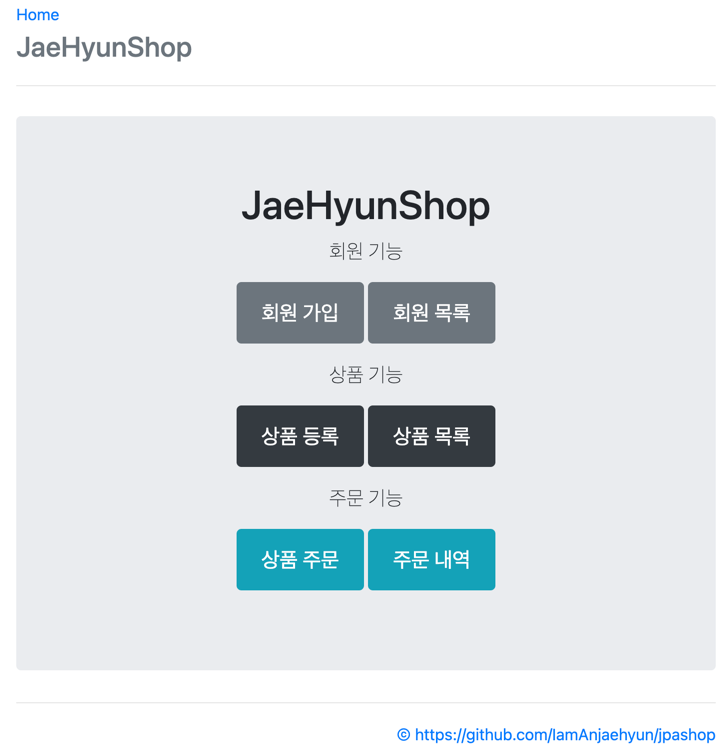

### JAEHYUNSHOP

## 📢 프로젝트 설명
- 실전! 스프링 부트와 JPA 활용1 - 웹 애플리케이션 개발  강의를 수강하고
제작한 프로젝트 입니다.

## ⚙ 개발 환경
- 운영체제 :  MacOS
- 통합개발환경(IDE) : IntelliJ
- JDK 버전 : JDK 11
- 데이터 베이스 : H2
- 빌드 툴 : Gradle
- 관리 툴 : GitHub

## 🔌 Dependencies

- Spring Boot DevTools
- Spring validation
- Lombok
- Spring Data JPA
- H2 DataBase
- Spring Web
- Thymeleaf

## 💻 기술 스택
- 백엔드
    - SpringBoot, Spring Data JPA
- 프론트엔드
    - HTML, CSS, Javascript, Thymeleaf, JavaScript
- 데이터베이스
    - H2 database

